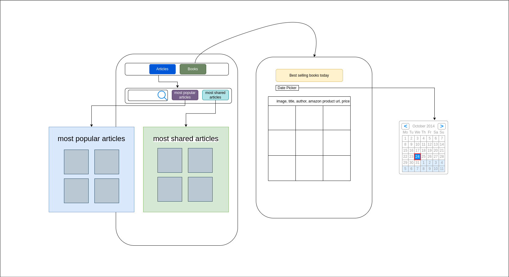

# API Integration with JavaScript and React

> A simple web app that integrates with a third-party API `New York Times API`. It shows list of popular books and posts fetched from the API.

## Built With

- JavaScript
- React
- Tailwind CSS
- NewYork Times API
- [React Date Picker](https://www.npmjs.com/package/react-datepicker) for date picker

## Live Demo

- [Ny-times-api-integration](https://ny-times-api-integration.vercel.app/)

## Features

- Fetches most popular articles sent in email
- Fetches most shared articles in social media
- Fetches best sellers book list. By default it shows the list of books from today and the `hardcover-fiction` list. You can change the date from the date picker menu.
- Navigation menu to switch between different sections
- Search bar to search for articles and shows the results. It also shows no results found message if no results found.
- An error message is shown if there is an error while fetching the data from the API.
- Loading spinner is shown while fetching the data from the API.

## Getting Started

To get a local copy up and running follow these simple example steps.

### Prerequisites

- NY Times API key
  - Create a developer account **[NY Times API](https://developer.nytimes.com/get-started)**
  - Create a new app and give it a name and description
  - enable the `Books API` and `Most Popular API`
  - Copy the API key
  
### Setup local environment

- Open terminal
- Clone the repository by using `git clone https://github.com/Eth3R-One/NY-Times-api-integration.git`
- Change directory by using `cd ny-times-api-integration`
- Create a `.env` file in the root directory
- Add the following environment variables to the `.env` file
  - `VITE_KEY` = `Your API key that you copied from NY Times API`
  - Save the file
- Run `npm install`
- Run `npm run dev`
- Open your browser and go to `http://localhost:5173/`

## Data flow diagram

## Bugs and Issues

Not found yet but if you encounter any bugs or issues, please feel free to open an issue in this repository.
